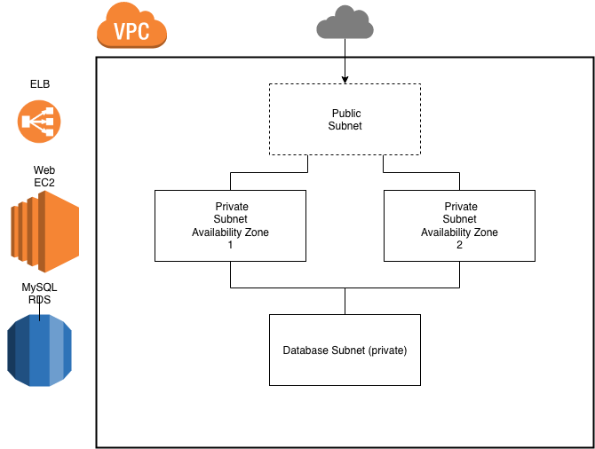

# Infrastructure  
**Requirements**
- Terraform CLI  
- AWS Credentials configured `~/.aws/credentials`  
  - ```shell
    # example ~/.aws/credentials file
    # default profile
    [default]
    aws_access_key_id=xxxxxxxxxxxxx
    aws_secret_access_key=xxxxxxxxx
    ```  
- Environment Variables
  - Here are helpful environment variables.  If not set, you will be prompted to supply values upon `terraform apply` and `terraform plan`  
  - ```shell 
    export TF_VAR_aws_profile=your_aws_profile
    export TF_VAR_DB_USER=username
    export TF_VAR_DB_PASSWORD=password
    ```
#### Getting Started  
```shell
# CD into Test environment
cd infrastructure/env/test

# Initialize Terraform
terraform init

# Plan the provision
terraform plan
```
#### Network
- Private VPC
- Load Balancer mediates between public traffic and web servers
- Linux EC2 Servers configured to communicate with ELB and RDS (private internally) via security groups
- MySQL Database configured to only communicate with the private subnet for the web servers.
  - *Note*:  The database login credentials are passed in at `terraform apply`.  The username and password will be stored in the terraform statefile.  This would not be version controlled, and would be stored in a remote, encrypted S3 bucket.
  
- DNS will not be provisioned, however, the code that would provision can be found in the `core` module.  With a registered domain name, terraform would provision `route53` hosted zone and a record for `payments.themarkup.org`.  It would take as output the public DNS of the `elb` and alias it behind the subdomain.  
- *Note*:  Not configured here is the code to provision and setup SSL.  In production, the ELB should be configured to only communicate via https.

# Deployment Pipeline  
(hypothetical)  

**Requirements**  
- Private Repo  
- Multiple Developers
- Master branch deployed upon code review & pull request mere  

1. Create an `IAM` role for the CI/CD tool of choice to allow the minimum amount of access needed.
1. Provision a `staging` and `production` environment.  Use the module pattern in `infrastructure` to configure separate environments (adding a subdomain `staging.payments.themarkup.org`).  
2.  Package the `payments.themarkup.org` application as a Docker Image (`./app/web/Dockerfile`).  
3.  Create two branches:  `master` and `staging`.
4.  Configure `circleci` or `gitlab` to:  
    1.  Build and tag the new docker image upon commit (semantically versioned)
    1.  Run any tests on the infrastructure and on the payments application code.
    1.  If passes, push the new build to a private docker registry (AWS).
    1.  If the branch is `master`, pull the image into the production EC2 instances and run a new container.  Gracefully stop and remove the old container.  If branch is `staging`, repeat process in the staging environment.
    1.  Send an automatic message to a Slack channel to keep the team informed of the updates.

With the goals of security, reliability, and quality in mind, I would strive for a continuously tested and deployed application.  Rather than deploy docker containers into EC2 (or ECS) instances, `payments.themarkup.org` would be deployed as `pods` of a Kubernetes cluster.  Orchestrating all the organization's infrastructure through Kubernetes would allow for robust monitoring, testing, and self-healing of the system, and a seamless development => production experience for developers.

Each change to `staging` or `master` would be submitted through a pull request that would initiate the automated tests (for the infrastructure and the application code).  In addition to the automated tests, pull requests would prompt a code review before being merged into master.  `staging` would always be deployed at `staging.payments.themarkup.org` and `master` would always be deployed at `payments.themarkup.org.`

I would configure a `docker-compose.yml` so that each developer would spin up a complete dev environment (test MySQL container with dummy payments data, Apache+PHP container mounted with the payments application code) using `docker-compose` to ensure a consistent environment between development machines and production.  Containerizing the development and production environments creates for a seamless developer experience and allows for all their focus to be on writing high-quality application code.  

As DevOps Engineer, I would strive to create an immutable infrastructure.  All Terraform Modules and Docker Images would be semantically versioned.  The infrastructure state (`terraform.tfstate`) would be a versioned file stored remotely in an AWS S3 bucket, allowing for auditability, testing, and rollback.